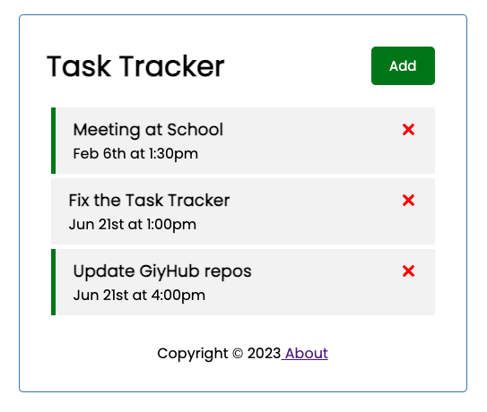
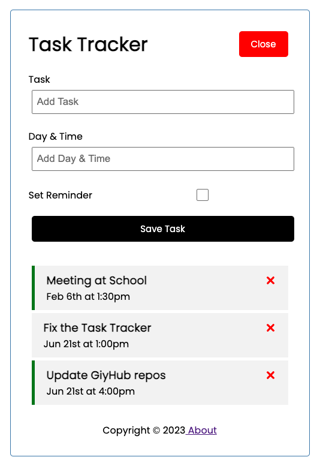
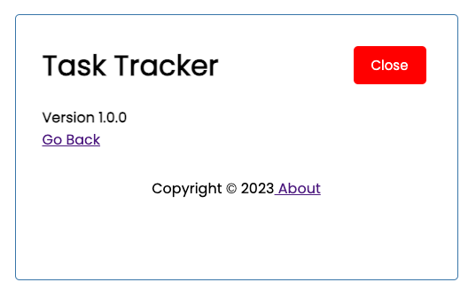

# React JS Crash Course Task Tracker

This project was built as a first taste of React from the Brad Traversy YouTube tutorial, [React JS Crash Course](https://www.youtube.com/watch?v=w7ejDZ8SWv8). 
* It is a simple task tracker that allows you to add and delete tasks 
* It also has a toggle feature that allows you to toggle the reminder on and off
* It uses the JSON server to simulate a backend server
This project was bootstrapped with [Create React App](https://github.com/facebook/create-react-app).

## Getting Started

1. Clone the repo to your local machine.
2. `npm install` to install all dependencies.
3. `npm run server` to start the JSON server.
4. `npm start` to start the React app.

## Technologies Used

* React JS
* JSON Server
* HTML
* CSS

## Example use

The app displays a list of tasks that you can add to, delete, and toggle the reminder on and off.
When adding a task, the add task button makes a form expand to allow you to add a task name and day and time.
When you double click on a task, it toggles the reminder on and off.
When you click on the x button, it deletes the task.

The main screen:

Adding a task:

The about display:
